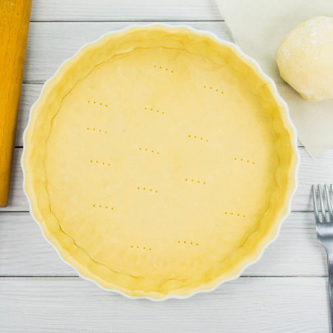

# French Suger Dough

## Ingredients
- 125 g of butter
- 75 g of Suger
- 250 g of flour
- 1 egg
- 1 pinch of salt

1. Work the butter, the suger and the pinch of salt into a a paste, until the colour shifts from yellow to white.
2. Add the egg and work the paste until homogenous.
3. Add the flour and work quickly to work it into a dough.
4. Flip the dough onto a table and work it with the palm of your hands (Not with Fingertips!).
5. Flatten the dough to about 1.5 - 2 cm of thickness and cut it into four parts. Stack these parts and once again flatten the dough out. Repeat three times
6. With the final though flattened. Wrap it in plastic foil and let it rest in the fridge for at least one hour.