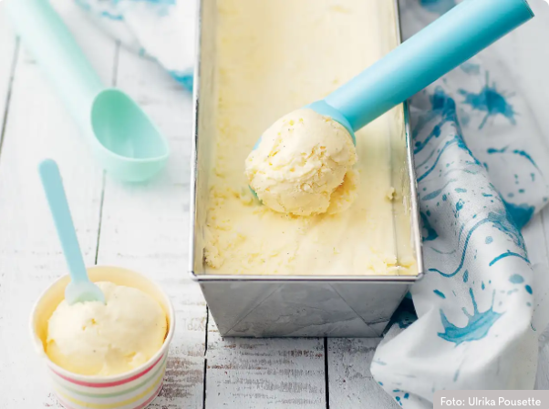

# Ice cream

## Ingredients

5 dl vispgrädde
1 burk kondenserad mjölk sötad (à 397 g)

## How to

1. Vispa grädden till mjuka toppar med elvisp. Tillsätt sötad kondenserad mjölk och vispa lite till. Vill du smaksätta glassen med något så gör du det efter detta steg.
1. Häll upp glassmeten i en behållare som rymmer minst 1,5 liter. Jag brukar hälla upp min smet i en brödform.
1. Plasta in glassen och låt den stå i frysen i minst 6 timmar innan servering.

