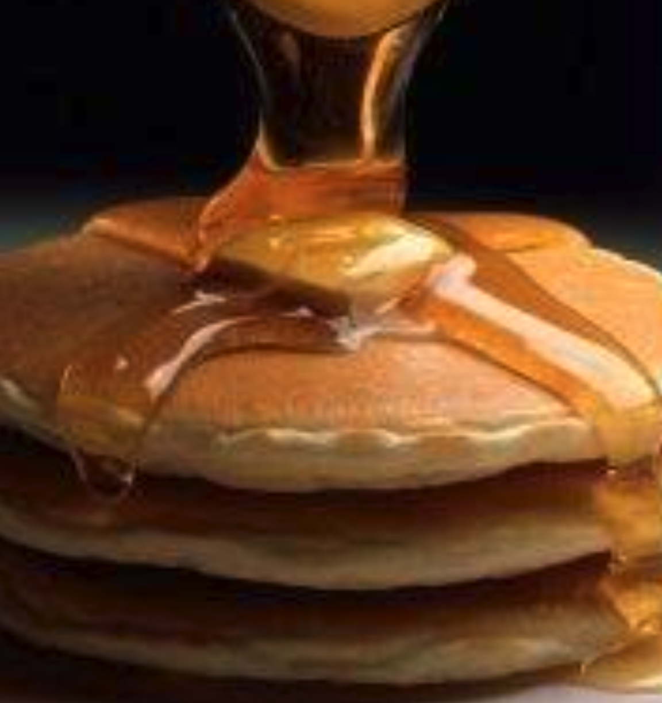

# American pancakes

## Ingredienser

6 port

- 2 stägg, lättvispade
- 3 dl mjölk
- 4 msk smör, smält
- 5 dl mjöl, minst ½ vetemjöl
- 4 tsk bakpulver, ev. mindre
- 1 tsk salt
- 4 msk strösocker, ev. delvis vaniljsocker

Till servering
smör
lönnsirap

## Method

1. Vispa ihop mjöl salt, socker & bakpulver i en stor skål. Vispa ihop äggen i en annan skål. Vispa sedan ner mjölk och smält smör.
1. Tillsätt de blöta ingredienserna till de torra. Blanda med en gaffel, vispa INTE.
1. Stek i smör i en ganska varm stekpanna. Smeten är ganska tjock så man får kanske ta en sked till hjälp.
1. Lagom stora pannkakor är en smaksak! 1 – 4 per stekpanna – beroende på vad du vill ha.
1. Värm tills bubblor börjar formas på ovansidan, vänd och stek tills de är gyllenbruna under. Är de lyckade blir de minst ½ cm tjocka.
1. Serveras med en klick smör ovanpå och dränkta i lönnsirap.

[Original recipe](https://www.tasteline.com/recept/american-pancakes/)