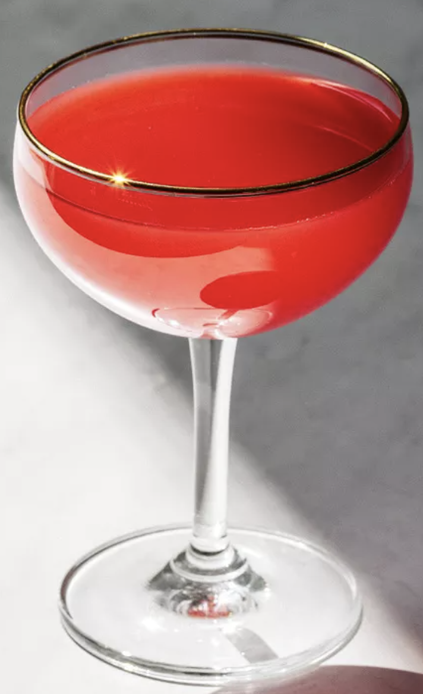

# Charlie Chaplin

Named for the comedic actor of the early film era, this pre-Prohibition cocktail, largely forgotten in modern times, is rich and indulgent enough to evoke old **Hollywood glamour**.

## Intended use
Become entertaining

## Ingredients

1 ounce sloe gin (such as Plymouth)
1 ounce apricot liqueur (such as Rothman & Winter)
1 ounce lime juice, freshly squeezed

Ounce to ml:
for an approximate result, multiply the volume value by 29,574. You do the math.

## How to make it

1. Add the sloe gin, apricot liqueur and lime juice into a shaker with ice and shake until well-chilled.
1. Strain into a chilled cocktail glass.

## Reference

[Link1](https://www.liquor.com/charlie-chaplin-cocktail-recipe-5094223)

