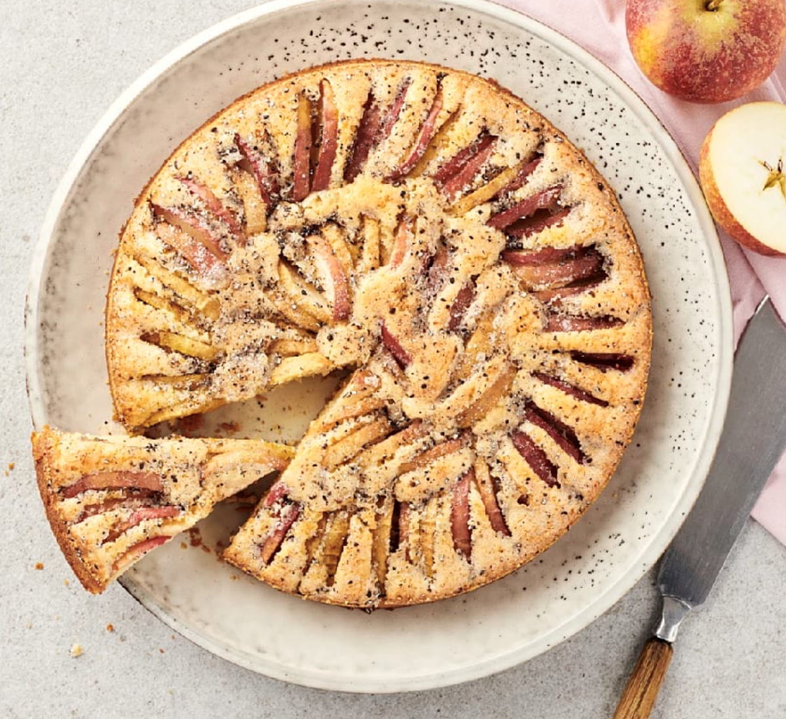

# Kardemummakaka med äpple och citron

## Ingredienser

For 8 bitar

### Kaka

- 125 g smör eller margarin
- 1 1/2 dl strösocker
- 1 tsk vaniljsocker
- 1  citron (endast det rivna skalet)
- 2  ägg
- 2 msk mjölk
- 2 1/2 dl vetemjöl
- 1 tsk bakpulver

## Fyllning och garnering

3  medelstora äpplen

1 tsk kardemummakärnor

1 msk strösocker

### Serveringsförslag
- glass
- vaniljsås
- lättvispad vispgrädde med vaniljsocker

## Gör så här

- Sätt ugnen på 175°C.
- Smörj en rund form med löstagbar kant, ca 24 cm i diameter (för 8 bitar) med matfett.

Kaka: 
- Smält matfettet och låt det svalna.
- Rör matfettet med socker, vanilj och citronskal. Tillsätt ett ägg i taget och vispa väl mellan varje. Tillsätt mjölken. 
- Vänd ner mjölet blandat med bakpulvret. Rör ihop till en slät smet. Häll smeten i formen.

Fyllning och garnering: 
- Skär äpplena i tunna klyftor. 
- Stick ner dem tätt i smeten. 
- Stöt kardemummakärnorna och blanda med sockret. Strö det över äpplena.

Grädda kakan i nedre delen av ugnen ca 40-45 minuter.

Till servering: 
- Servera kakan ljummen eller kall med glass, vaniljsås eller lättvispad grädde smaksatt med vaniljsocker.

[Original receipe from ICA](https://www.ica.se/recept/kardemummakaka-med-apple-och-citron-677072/)

