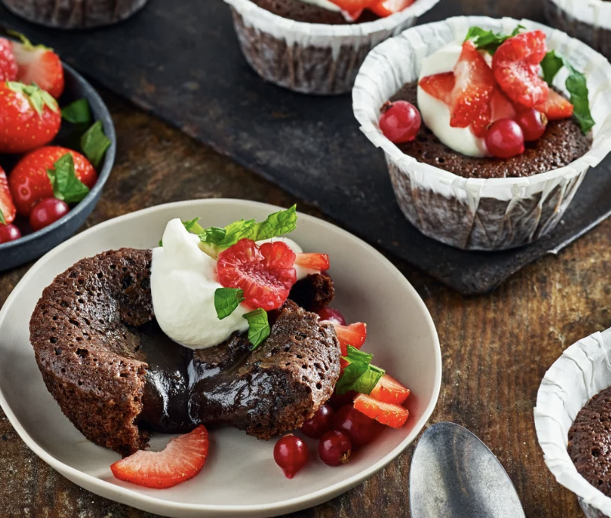

# Kladdkakemuffins

**12 st**

## Ingredienser 

- Svenskt Smör från Arla® 150 g
- Strösocker 3 dl
- Kakao 1 dl
- Vaniljsocker ½ msk
- Salt 2 krm
- Ägg 3
- Vetemjöl 2 dl

## Gör så här

1. Sätt ugnen på 200° eller 180° varmluft.
1. Smörj en muffinsplåt eller sätt ner 12 bakformar i plåten.
1. Smält smöret i en kastrull och låt svalna lite.
1. Rör ner övriga ingredienser (i den ordningen de står i receptet) i kastrullen med smör. Rör till en slät smet. Fördela smeten jämnt i formarna.
1. Grädda i mitten av ugnen 10-12 min, tills ytan precis har stelnat. De ska fortfarande vara kladdiga i mitten. Låt svalna.
1. Toppa kladdkakemuffinsen med lättvispad grädde och gärna färska bär.

Orginal receptet finns på [Arlas hemsida](https://www.arla.se/recept/kladdkakemuffins/).

