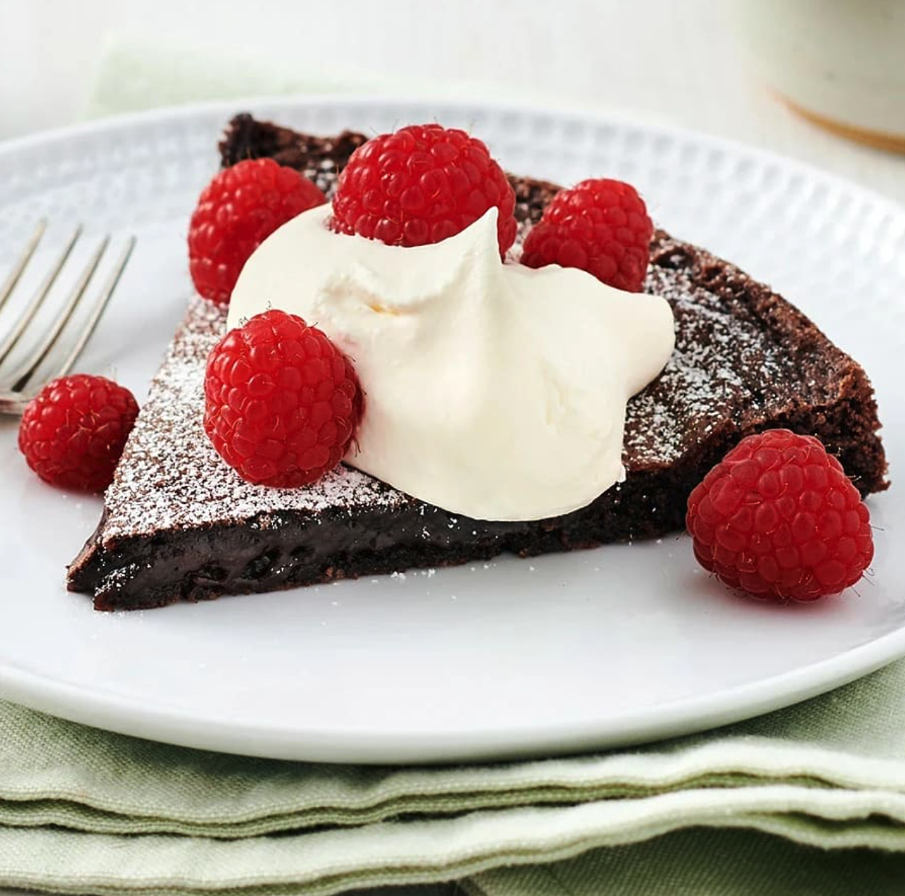
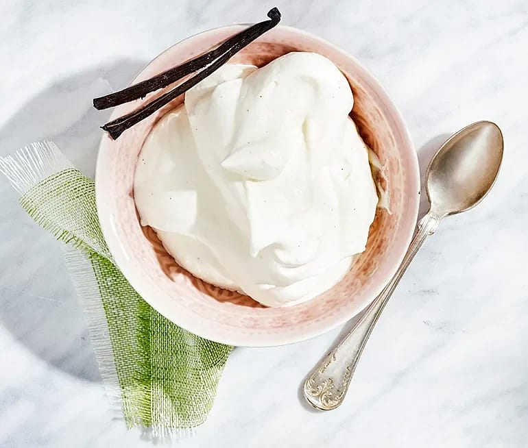

# Kladdkaka

## Ingredienser

ca 8 bitar

- smör till formen
- ströbröd till formen
- 100 g smör
- 2 st ägg
- 2 1/2 dl strösocker
- 3 msk kakao
- 2 tsk vaniljsocker
- 1 1/2 dl vetemjöl
- 1 krm salt

## Gör så här

- Sätt ugnen på 200°C.

- Smörj och bröa en form med löstagbar kant, ca 24 cm i diameter (för 8 bitar) eller spänn fast ett bakplåtspapper på botten.

- Smält smöret i kastrull, låt svalna något.

- Vispa ihop ägg och socker (använd inte en elvisp).

- landa kakao, vaniljsocker, vetemjöl och salt i en bunke och rör ner i äggblandningen.

- Tillsätt det smälta smöret och blanda försiktigt ihop till en jämn smet och häll sedan över smeten i formen.

- Grädda mitt i ugnen i ca 10-15 minuter (öka eller minska tiden vid behov beroende på hur kladdig du vill ha den).

- Ta ut kladdkakan och låt svalna.

- Sikta florsocker över om så önskas. 

***Optional:*** Servera med Vaniljgrädde och färska bär.

[Orignal recept från ica](https://www.ica.se/recept/kladdig-kladdkaka-722982/)

# Vanijlgrädde

## Ingredienser

**10 portioner**

- 3 dl vispgrädde
- 1 - 1 1/2 msk strösocker
- 1/2  vaniljstång

## Gör så här

1. Vispa grädden luftigt. Söta med socker.
2. Dela och skrapa ur vaniljstången. Blanda försiktigt ner vaniljskrapet i grädden.

[Orignal recept från ica](https://www.ica.se/recept/vaniljgradde-338447/)

