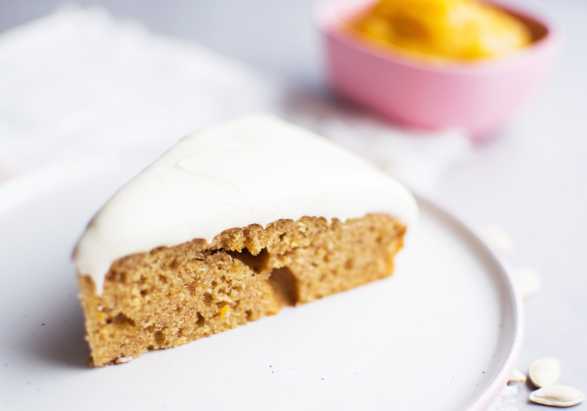

# Pumpakaka

# Ingredienser

## Kakan
- 2 dl pumpapuré
- 1 1/2 dl strösocker
- 1 dl havregrädde
- 1 dl neutral olja (t.ex. raps - ej kallpressad utan neutral)
- 2 tsk kanel
- 1 tsk vaniljsocker
- 1/2 tsk kardemummakärnor
- 1/2 tsk malen ingefära
- 1/2 tsk salt
- Rivet skal av 1/2 apelsin
- 4 dl vetemjöl
- 1/2 dl potatismjöl
- 2 1/2 tsk bakpulver

## Frosting
- 75g PåMackan eller annat växtbaserat substitut för naturell färskost
- 50g veganskt margarin (rumsvarmt/mjukt)
- 3 dl florsocker
- 1 tsk citronjuice

# Preparation

## Kakan
1. Börja med att värma upp ugnen till 175°C. Smöra (veganskt margarin) eller olja en springform.

2. Mät upp 1/2 tsk kardemummakärnor och mal dem i en mortel. Mortla till de är malna men det kan vara lite mindre bitar i, det behöver alltså inte vara lika finmalet som mjöl.

3. Till en bakskål/bunke, tillsätt alla de blöta ingredienserna först + kryddorna. Det vill säga, tillsätt pumpapuré, havregrädde, olja, kanel, vaniljsocker, mortlad kardemumma, malen ingefära och salt.

4. Tillsätt även strösocker och riv ned apelsinskal. Rör om allt till en slät smet och rör noga så att kryddorna har fördelats jämnt i smeten och se till så att det inte har bildats klumpar av kryddorna.

5. Slutligen, använd en sikt och sikta ned vetemjöl, potatismjöl och bakpulver. Rör om till en någorlunda slät smet. Rör inte för mycket utan vik ned mjölet med hjälp av slickepotten ned i de blöta ingredienserna.  

6. Tillsätt smeten till den smorda springformen. Baka kakan mitt i ugnen i ca 50-60 minuter. 

- Kakan kan se klar ut efter 30-40 minuter men låt dig inte frestas att ta ut den då. Eftersom den innehåller pumpapuré som tillför mycket vätska och gör smeten lite tyngre så är det bättre att baka kakan lite för länge än för kort tid. Annars riskerar kakan att bli degig!

7. Kolla med en sticka om kakan är klar. Låt kakan svalna helt innan glasyren breds över.

## Frosting

1. Väg upp 50g margarin och tillsätt det till en skål. Se till att det är någorlunda mjukt.

2.  Tillsätt 1/2 förpackning PåMackan till margarinet, 75g. Vispa samman dessa två ingredienser med en elvisp eller stavmixer med visp-tillägg. Vispa till de 2 ingredienserna har blandats samman.

3. Tillsätt 1 dl i taget av florsockret vispa på låg hastighet till att börja med för att undvika rökmoln. Vispa ned 1 dl till det precis gått ihop, tillsätt då nästa och gör likadant. Slutligen tillsätt det sista dl-måttet. Vispa bara några sekunder extra på slutet för att få en slät men fast frosting.

4. Tillsätt sist citronjuicen och vispa samman till en frosting. Låt förvaras kallt.

5. Bred på frostingen på kakan när kakan har svalnat helt. Förvara kakan i kylen, gärna i en tårtbox/kupa.