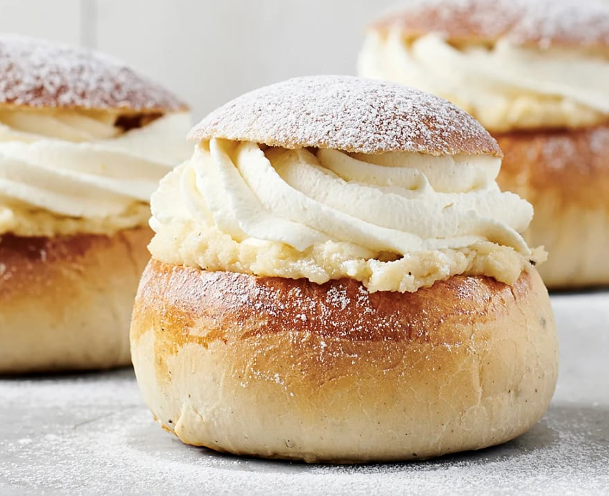

#    Klassiska semlor

## Ingredienser

- 1 1/2 tsk kardemummakärnor
- 25 g jäst (25 g jäst motsvarar 1/2 paket à 50 g)
- 100 g smör eller margarin
- 2 1/2 dl mjölk
- 1 ägg
- 1 dl strösocker
- 2 krm salt
- ca 8 dl vetemjöl (8 dl motsvarar ca 480 g)

Fyllning:

- 3/4 dl strösocker
- 3/4 dl vatten 
- 1 krm bittermandelarom
- 200 g mandelmassa
- 1/2 dl rostade mandlar

Garnering:
- 3 dl vispgrädde
- florsocker

## Gör så här:
- Mortla kardemumman. Smula jästen i en bunke. Smält matfettet i en kastrull eller i en skål i mikrovågsugnen på full effekt (max 800 W) ca 1 min. Tillsätt mjölken och värm till fingervarmt, 37°C. Häll lite av degvätskan över jästen och rör tills den löst sig.

- Tillsätt resten av degvätskan, ägg, socker, salt, kardemumma och nästan allt vetemjöl, spara lite till utbakningen. Arbeta degen smidig för hand eller i maskin tills degen är slät och blank.

- Låt degen jäsa övertäckt ca 30 min.

- Fyllning: Koka upp socker och vatten, så att sockret löser sig. Ta kastrullen från plattan och tillsätt bittermandelarom. Skär mandelmassan i små bitar och vispa mandelmassan och nästan all sockerlag till en jämn bredbar smet (späd eventuellt med lite mer sockerlag). Hacka mandlarna grovt och blanda ner i mandelmassafyllningen.

- Sätt ugnen på 200°C.

- Ta upp degen på mjölad arbetsbänk och knåda den smidig med resterande mjöl. Dela degen i 10 bitar (för 10 st). Forma varje bit till en slät bulle som läggs på en bakpappersklädd plåt. Låt bullarna jäsa övertäckta ca 30 min.

- Pensling: Pensla bullarna med uppvispat ägg.

- Grädda mitt i ugnen i ca 14 min. Låt bullarna kallna på galler.

- Garnering: Skär av ett lock på varje bulle. Bred på fyllningen. Vispa grädden, gärna med elvisp. Klicka eller spritsa grädden på bullarna och lägg på locken. Pudra över florsocker och servera semlorna.

Receptet kan hittas på [ICAs hemisda](https://www.ica.se/recept/klassiska-semlor-292482/?from=ica-recept)

