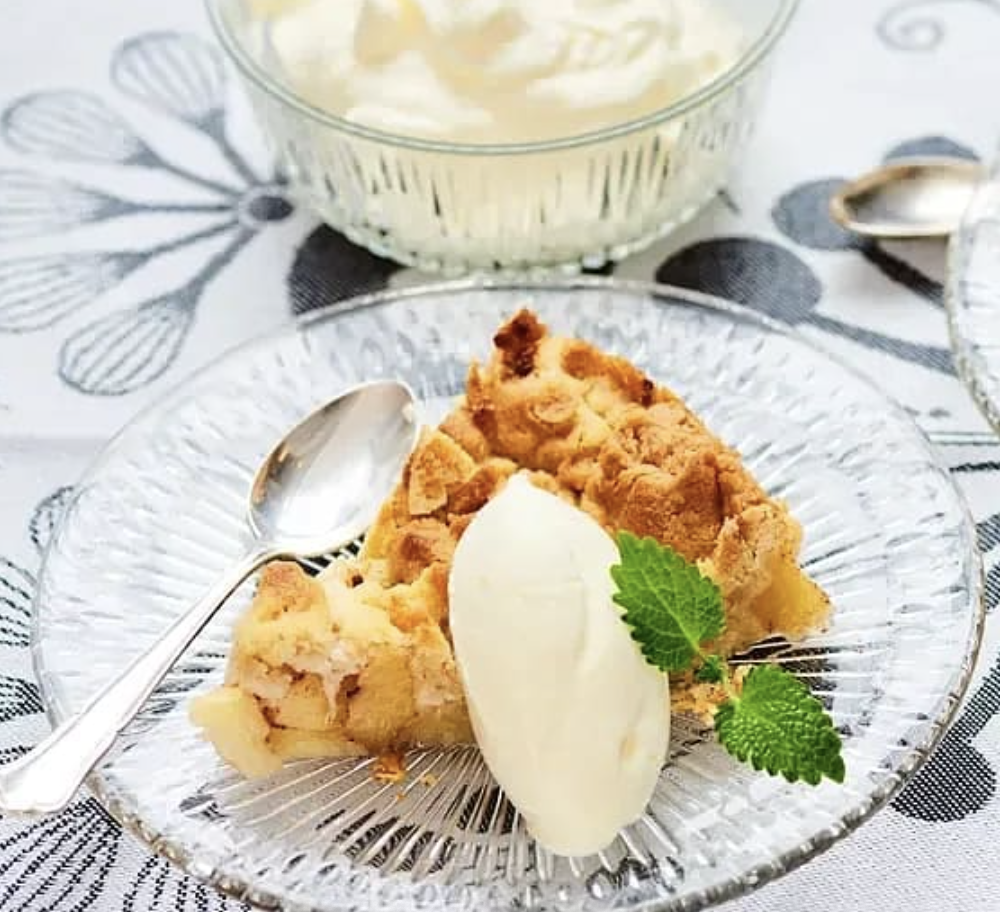

# Smulpaj med äpple

## Ingredienser

6 portioner

### Smul

- 125 g kallt smör
- 2 dl vetemjöl
- 1 dl havregryn
- 1 1/2 dl socker
- 1/2 - 1 tsk flingsalt (viktigt att flingsalt används, används vanligt salt minska på mängden)

### Fyllning

- ca 800 g äpplen
- 1 tsk kanel
- 2 tsk socker
- 1 krm flingsalt (viktigt att det är flingsalt som används)
- smör till formen

### Till servering
vispad grädde
vaniljsås
glass

## Gör så här

1. Sätt ugnen på 225°C.
1. Smul: Skär smöret i bitar. Nyp ihop smör, mjöl och havregryn till en smulig massa. Blanda i socker och flingsalt, ta lite i taget av flingsaltet och smaka av degen allt eftersom så att sältan blir lagom.
1. Fyllning: Skala, kärna ur och skär äpplena i mindre bitar. Blanda äpplena med kanel, socker och flingsalt i en smord pajform, ca 28 cm i diameter (för 6 port).
1. Fördela smulorna över äpplena och grädda pajen mitt i ugnen 20–25 minuter, tills den fått fin färg.
1. Till servering: Låt svalna något och servera med vispad grädde, Vaniljsås eller glass.

- [Link to original recipe](https://www.ica.se/recept/varldens-godaste-appelsmulpaj-714125/)

