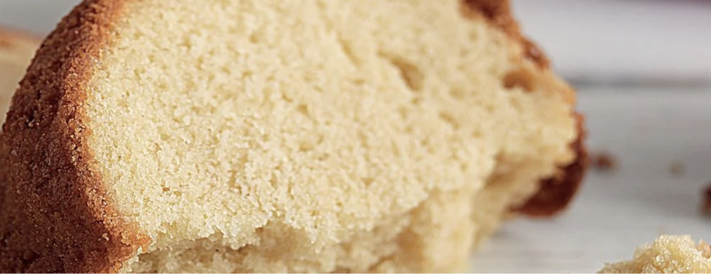

# Sockerkaka

## Ingredienser

Receptet gäller för 10 bitar

- 75 g Svenskt Smör från Arla® 
- 1 dl mjölk
- 2 ägg
- 2 dl Strösocke
- 2 tsk Vaniljsocker
- 3 dl Vetemjöl
- 1.5 tsk Bakpulver

## Gör så här

1. Sätt ugnen på 175°.
1. Smörj och bröa en form som rymmer ca 1 ½ liter.
1. Smält smöret i en kastrull, häll i mjölken och låt det svalna.
1. Vispa ägg och socker ljust och pösigt, gärna med elvisp.
1. Blanda ner vaniljsocker och mjöl blandat med bakpulver och till sist mjölkblandningen. Rör snabbt ihop till en jämn smet och i formen.
1. Grädda i nedre delen av ugnen i ca 35 min.

## References

[original recipe](https://www.arla.se/recept/sockerkaka/)