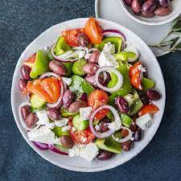

# Greek salad

## Ingredients
- Tomato
- Cucumber
- Red onion
- Feta cheese
- Olives
- Olive oil

## Preparations
1. Cut all the vegetables into pieces of prefered sizes.
1. Put the vegetables in a bowl.
1. Pour some oil on the salad.