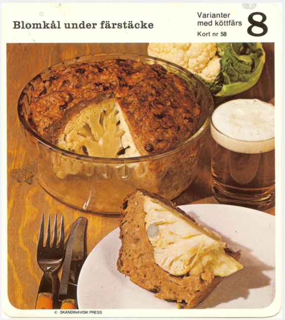

# Cauliflower with meat cover
This delicacy is a Swedish 80's classic.

## Ingredients

- One head of a cauliflower
- Minced beef 250g
- Breadcrumbs 25g
- Cream 50 ml 
- Salt and Pepper

## Instruction

- Preheat the oven to `225 C`
- Cook the cauliflower head in well salted water for `5 minutes`
- Pour the cream into the breadcrumbs and let sit over the time that the cauliflower is cooked
- Mix together the breadcrumbs and the minced meat, add salt and pepper for "flavor"
- Spread the meat mixture over the cauliflower and put it into the oven for `20 minutes` 
- Take out the cauliflower, and serve with a beer of your choice
