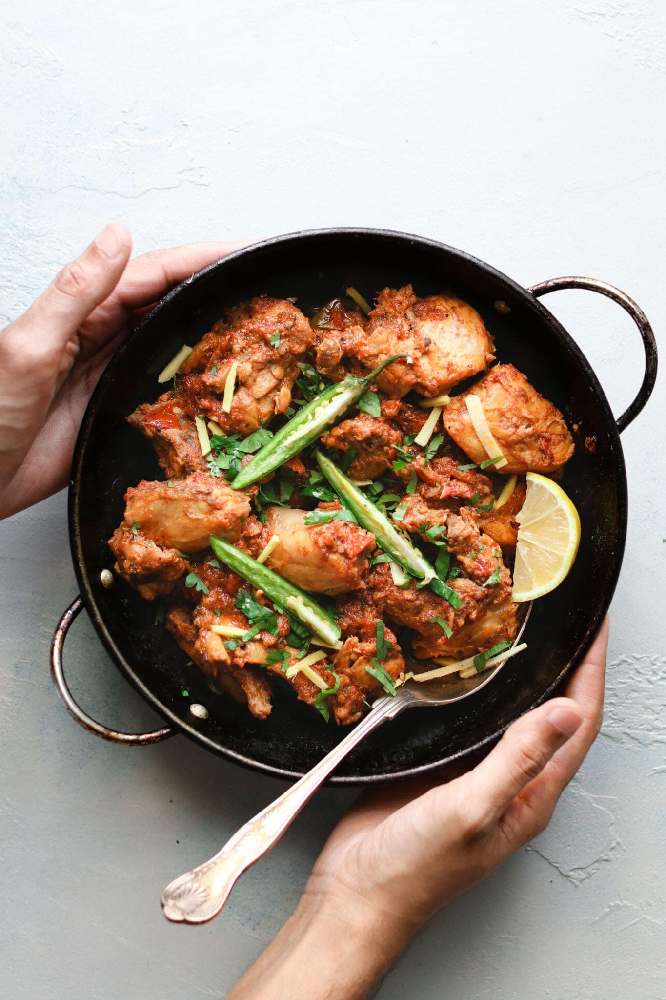

# Fried Chicken known as chicken karahi.

## Ingredients
 - Chicken ~1Kg with bones
 - Tomatoes equal amount by volume
 - Salt ~1 table spoon
 - Chilli 
 - Garlic
 - Ginger
 - Oil

## Preparation
 1. Clean and remove skin of chicken.
 2. Add Oil, meshed ginger, garlic and chicken to pan and fry.
 3. Add tomatoes after chicken is brwonish.
 4. Fry untill ready.
 5. garnish with chilli and ginger on top at the end.

