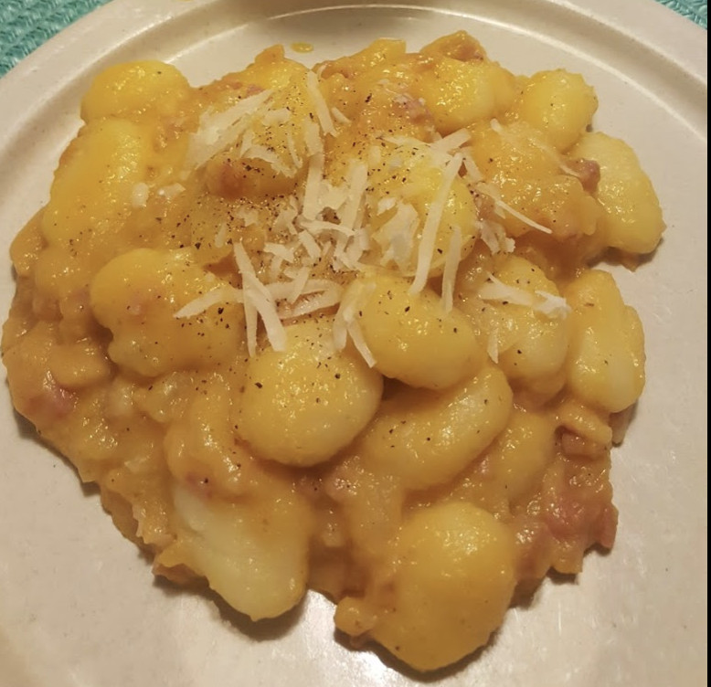

# Gnocchi with pumpkin, onion and smoked bacon.

## Ingredients
- Gnocchi (800 gr)
- Pumpkin (400 gr)
- 1 Onion
- Smoked bacon (200 gr)
- Parmesan cheese
- Extra virgin oil
- Rosemary
- Salt

## Preparation

Clean the pumpkin by removing the rind, seeds and internal filaments. Cut the pumpkin into small cubes. Pour 3 tablespoons of extra virgin olive oil into a pan, the thinly sliced ​​onion and diced pumpkin. Cook over medium heat for 12-14 minutes, turning it often with a wooden spoon.

If it dries too much, add a few tablespoons of water. Finally, season with salt. Transfer 2/3 of the pumpkin in a blender or immersion blender, add the grated parmesan cheese and reduce it to a puree. Transfer the smoked bacon into sticks in a pan with a drizzle of extra virgin olive oil and let it become crispy over medium heat, turning it often.

Cook the potato gnocchi in plenty of boiling salted water. Drain them as soon as they come to the surface. Transfer them to a large bowl and add the pumpkin cream, with the unmixed pumpkin and finally with the crispy bacon. Mix well and a final touch is a sprinkling of chopped rosemary that will give the Gnocchi with pumpkin and bacon a delicious scent.
