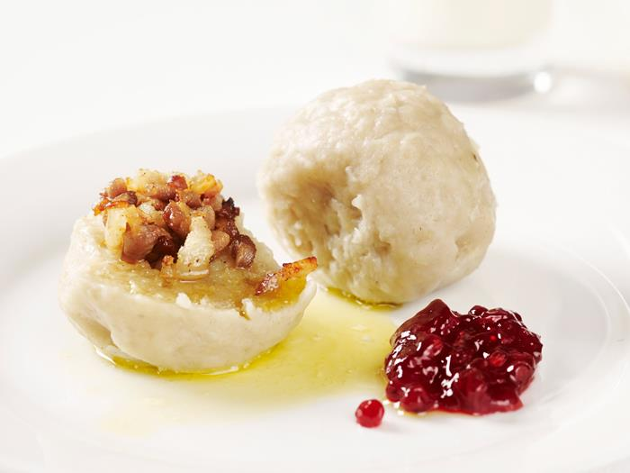

# Pitepalt

## Ingredients

- 10-12 råa potatisar
- 1 msk salt
- 7 dl vetemjöl
- 300 g fläsk (rimmat eller färskt)

## Preparations

1. Skär fläsket i tärningar. 

2. Fyll en rymlig kastrull med vatten och låt koka upp medan du gör smeten iordning, salta vattnet (knappt en msk salt per liter vatten).

3. Skala och riv potatisen (låt eventuell vätska rinna av), blanda ner salt och vetemjöl och arbeta ihop degen.

4. Skeda upp en degklick, något mindre än en tennisboll i rejält mjölade händer. Tag två mjölade fingrar och tryck till i degklicken så att det blir plats för en matsked fläsk. Lägg i fläsket och rulla palten till en boll. Sänk ner paltarna allt eftersom de blir klara i det kokande vattnet.

5. Använd träslev och rör om försiktigt då och då. När sista palten har åkt ner i kastrullen låt samtliga paltar koka i 45 min - 1 timme. Servera palten med smör och lingonsylt.
