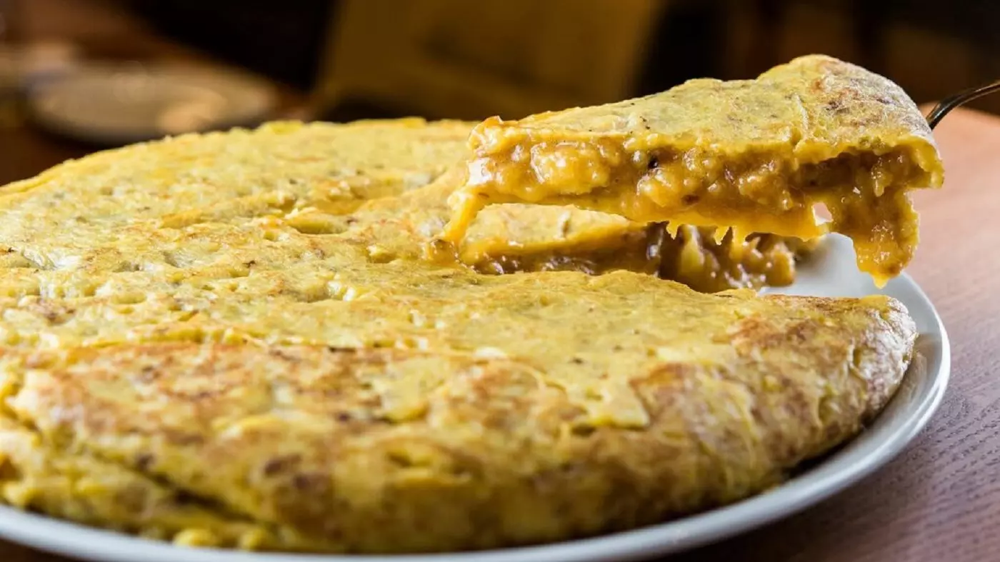

# Tortilla Española

## Ingredients
- Potatoes
- 1 Medium onion
- 1 cup of olive oil
- Salt and black pepper
- Eggs (4 eggs for every 3 potatoes)

## Preparation

1. Peel and thinly slice potatoes and onions; it's easiest if you use a mandoline. Meanwhile, heat oil in nonstick skillet over medium heat. After 3 or 4 minutes, drop in a potato slice. When tiny bubbles appear around its edges, add potatoes, onions, a good pinch of salt and a liberal sprinkling of pepper. Gently turn mixture in oil with a wooden spoon, and adjust heat so oil bubbles lazily.

    

2. Cook, turning potatoes gently every few minutes, until they are tender when pierced with a small knife. Adjust the heat so they do not brown. If potatoes begin to break, they are overdone; stop cooking immediately. As potatoes cook, beat eggs with some salt and pepper in a large bowl.

3. Drain potatoes in a colander, reserving oil. Wipe out skillet, and heat over a medium flame for a minute. Add 2 tablespoons oil. Gently mix warm potatoes with eggs, and add to skillet. As soon as edges firm up, after a minute or so, reduce heat to medium-low. Cook 5 minutes.

    

4. Insert a rubber spatula all around edges of tortilla to make sure it will slide from pan. The top will still be runny. Carefully slide out onto a plate. Cover with another plate, and holding plates tightly, invert them. Add another tablespoon oil to skillet, and use the spatula to coax tortilla back in. Cook 5 minutes, then slide from skillet onto a clean plate. Serve warm (not hot), or at room temperature. Do not refrigerate.

    
