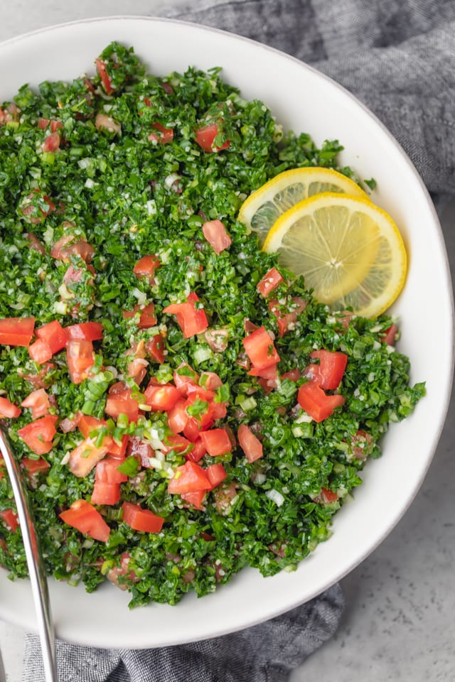

# Tabbouleh Salad.

## Ingredients
- 1 cup extra virgin olive oil
- 9 tablespoons lemon juice
- 0.75 cup extra fine bulgur wheat
- 6 bunches parsley about 2 cups chopped
- 3-6 vine-ripe firm tomatoes
- 6 green onions both green and white part
- 0.75 cup fresh mint leaves optional
- Salt and pepper to taste

## Preparation

1. In a small bowl, whisk together olive oil and lemon juice until well combined. Then add the bulgur to the dressing and let it soak until it is soft and plumped, about 15 minutes.

2. Meanwhile, prepare the vegetables by washing, drying thoroughly and finely chopping them. When preparing the tomatoes, it helps to use a colander to drain the excess juice, which you can use in another recipe at a later time.

3. Place the chopped vegetables in a large bowl. Add the optional mint. Season with salt and pepper. Then pour the bulgur and dressing mixture over. Gently toss to combine.

4. Serve at room temperature or cold, with lettuce if desired.
